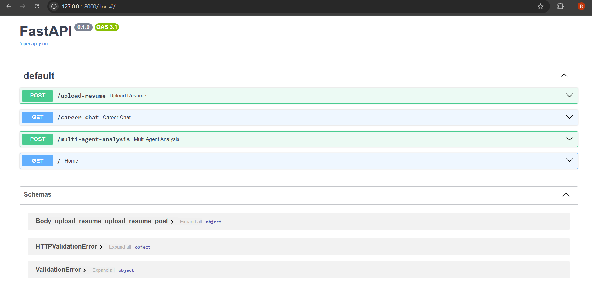
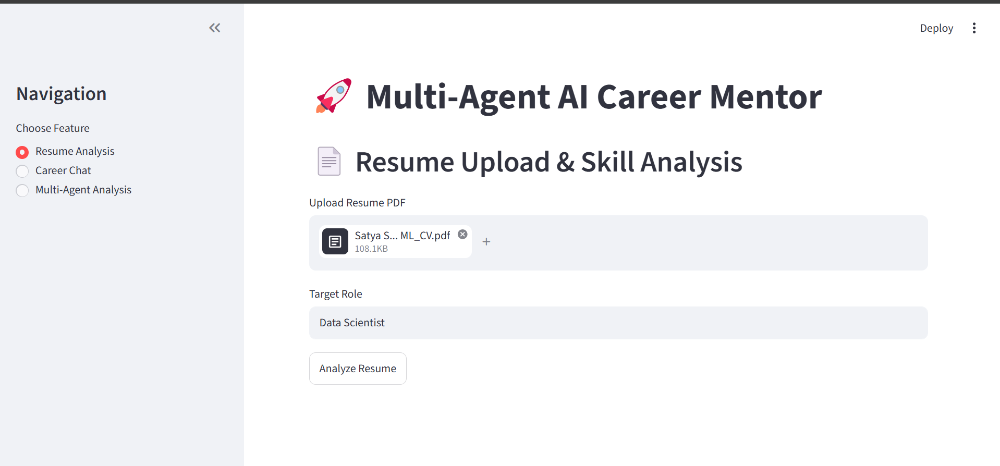
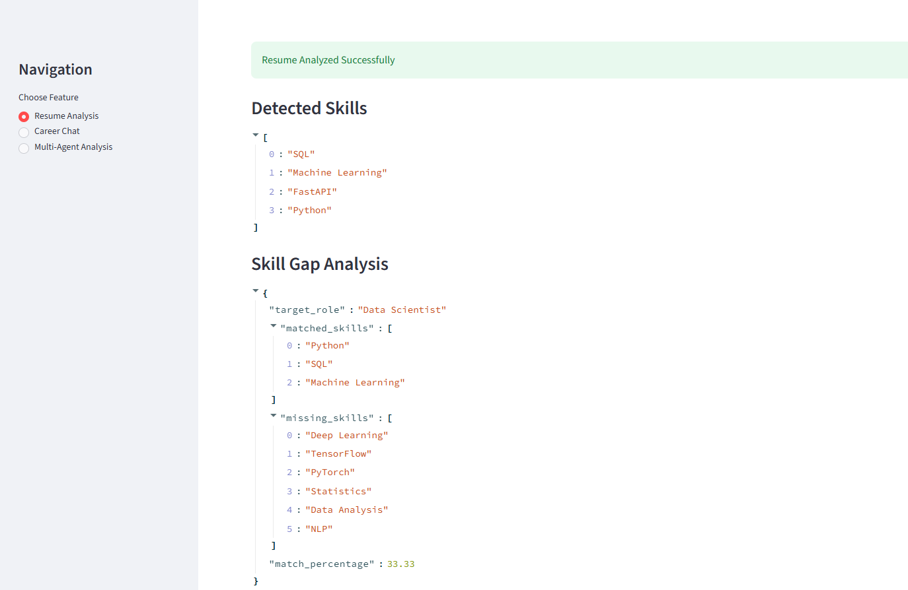
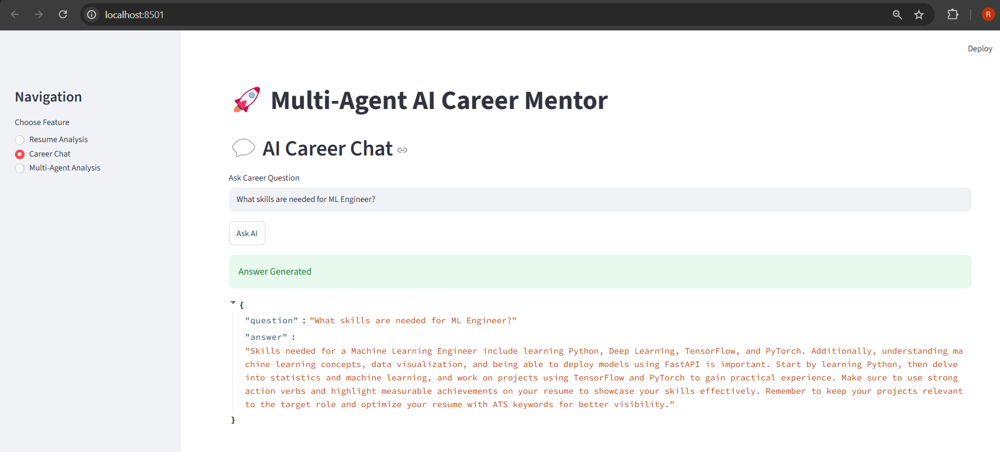
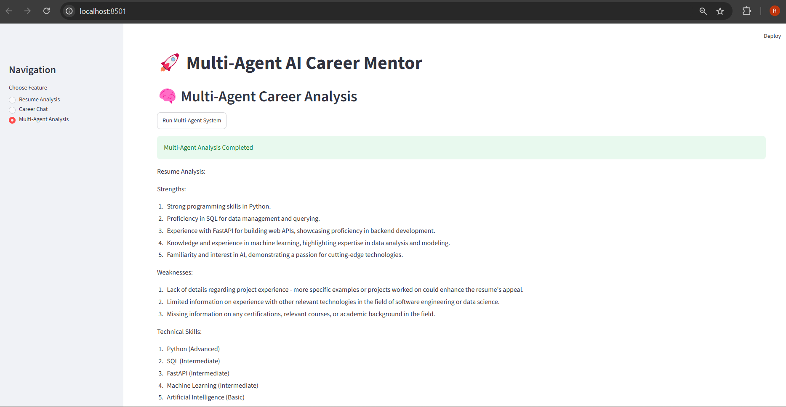
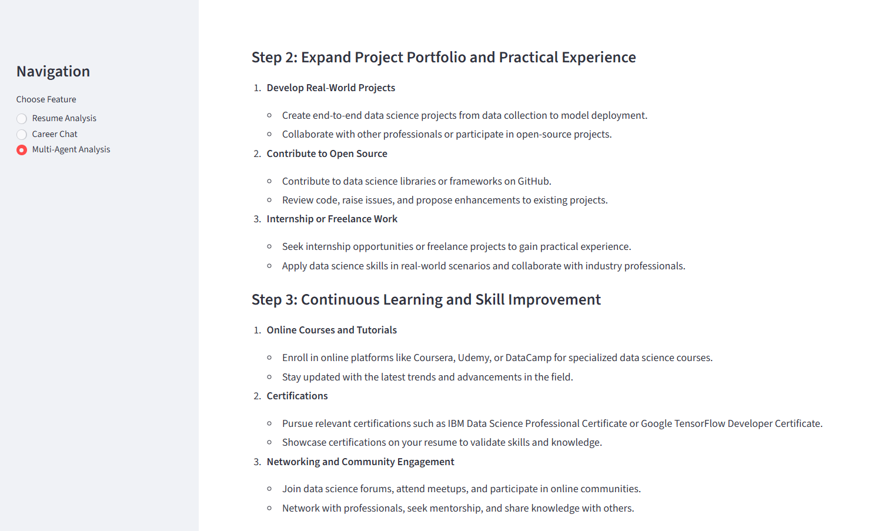

# 🚀 Multi-Agent AI Career Mentor

An AI-powered career guidance platform designed to help students and aspiring professionals improve their career readiness through intelligent resume analysis, personalized career guidance, interview preparation, and AI-driven learning roadmaps.

This project combines modern AI technologies, multi-agent systems, FastAPI backend architecture, and Streamlit frontend development to create an interactive career mentoring experience.

---

# 📌 Project Overview

The **Multi-Agent AI Career Mentor** is a smart career assistance system that uses AI agents to simulate different professional mentoring roles.

The platform provides:

* Resume analysis
* Skill gap identification
* AI-based career guidance
* Personalized learning roadmaps
* Interview preparation support

The system was designed to demonstrate practical implementation of:

* Multi-agent AI orchestration
* NLP-powered career assistance
* Backend API development
* Interactive frontend integration
* AI workflow automation

---

# ✨ Features

## ✅ Resume Analysis

* Extracts and evaluates technical skills
* Identifies strengths and weaknesses
* Provides AI-driven feedback

## ✅ Skill Gap Detection

* Compares user skills with target roles
* Suggests missing technologies and concepts
* Helps users align with industry requirements

## ✅ Personalized Learning Roadmaps

* Generates structured learning paths
* Suggests technologies and concepts to learn
* Provides beginner-friendly guidance

## ✅ AI Career Chatbot

* Answers career-related questions
* Provides professional guidance
* Generates beginner-friendly explanations

## ✅ Interview Preparation

* Helps users prepare for technical interviews
* Provides guidance for AI/software roles
* Suggests practical improvement strategies

## ✅ Multi-Agent AI Workflow

Implemented using CrewAI agents:

* Resume Analyzer Agent
* Skill Gap Expert Agent
* Roadmap Generator Agent
* Interview Coach Agent

---

# 🏗️ System Architecture

## Frontend

* Streamlit

## Backend

* FastAPI

## AI Orchestration

* CrewAI Multi-Agent Framework

## AI Integration

* OpenAI / OpenRouter APIs

## NLP & Data Processing

* LangChain
* Scikit-learn
* Pandas

## Additional Components

* PDF Resume Parsing
* Semantic Career Guidance Pipeline
* AI Prompt Engineering

---

# 🧠 Technologies Used

| Technology   | Purpose                   |
| ------------ | ------------------------- |
| Python       | Core Programming Language |
| FastAPI      | Backend API Development   |
| Streamlit    | Frontend UI               |
| CrewAI       | Multi-Agent AI Framework  |
| OpenAI API   | AI Model Integration      |
| LangChain    | AI Workflow Utilities     |
| Pandas       | Data Handling             |
| Scikit-learn | ML Utilities              |
| PDFPlumber   | Resume Parsing            |

---

# 📂 Project Structure

```bash
multi-agent-ai-career-mentor/
│
├── backend/
│   ├── agents/
│   ├── rag/
│   ├── routes/
│   ├── utils/
│   └── main.py
│
├── frontend/
│   └── app.py
│
├── screenshots/
│
├── requirements.txt
├── runtime.txt
├── README.md
└── .gitignore
```

---

# ⚙️ Installation & Setup

## 1️⃣ Clone Repository

```bash
git clone https://github.com/RohithMusulla/multi-agent-ai-career-mentor.git
```

---

## 2️⃣ Create Virtual Environment

```bash
python -m venv venv
```

---

## 3️⃣ Activate Environment

### Windows

```bash
venv\Scripts\activate
```

### Linux / Mac

```bash
source venv/bin/activate
```

---

## 4️⃣ Install Dependencies

```bash
pip install -r requirements.txt
```

---

# 🔑 Environment Variables

Create a `.env` file in the root directory.

```env
OPENAI_API_KEY=your_api_key
OPENAI_BASE_URL=https://openrouter.ai/api/v1
```

---

# ▶️ Running the Application

## Start Backend

```bash
uvicorn backend.main:app --reload
```

Backend runs at:

```bash
http://127.0.0.1:8000
```

---

## Start Frontend

```bash
streamlit run frontend/app.py
```

Frontend runs at:

```bash
http://localhost:8501
```

---

# 📷 Screenshots

## FastAPI Swagger Docs



## Streamlit Dashboard



## Resume Analysis



## Career Chat



## Multi-Agent Analysis 1



## Multi-Agent Analysis 2




# 🎯 Key Learning Outcomes

This project helped in gaining practical experience with:

* AI workflow orchestration
* Prompt engineering
* Multi-agent AI systems
* Backend API development
* Frontend integration
* Resume parsing
* AI-powered recommendation systems
* Software architecture design
* GitHub project management
* Deployment workflows

---

# 🚀 Future Improvements

* Advanced Retrieval-Augmented Generation (RAG)
* Cloud deployment support
* User authentication system
* Personalized dashboards
* Database integration
* Real-time career analytics
* Advanced resume scoring system
* AI-powered mock interview simulator

---

# 👨‍💻 Author

**Musulla Satya Sai Rohith**

Aspiring AI Engineer and Software Developer passionate about:

* Artificial Intelligence
* Machine Learning
* Backend Development
* Intelligent Career Guidance Systems

---

# 📜 License

This project demonstrates practical implementation of AI-powered career assistance systems using modern backend technologies, multi-agent architectures, and intelligent automation workflows.

